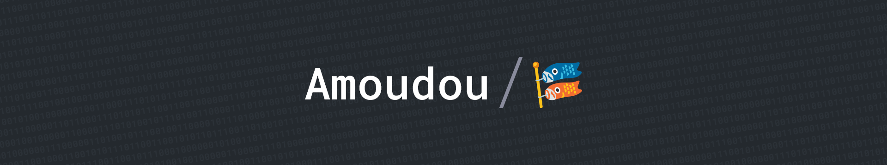

## Hi there, I'm Adhavane 👋

### 👨🏻‍💻 About me

- 🎓 I'm a student at [Université de Technologie de Compiègne](https://www.utc.fr/) in France
- 🌱 I'm currently learning about **Computer Science** and **Software Engineering**
- 📫 How to reach me: [mail](mailto:adhavane.moudougannane@etu.utc.fr) or [LinkedIn](https://www.linkedin.com/in/adhavane-moudougannane-aa5b36273/)
- ⚡ Fun fact: Blood type **O+**

### 🛠 Tech Stack

#### 📋 Languages

#### 💾 Databases

#### 📚 Frameworks, Platforms and Libraries

#### 🎨 Design

### 📈 Stats

